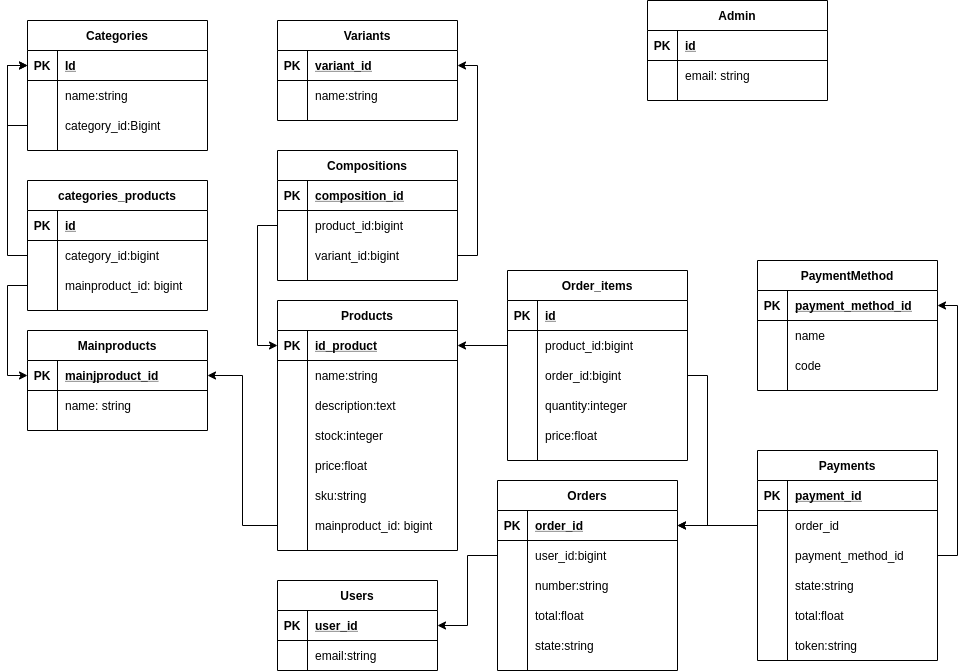
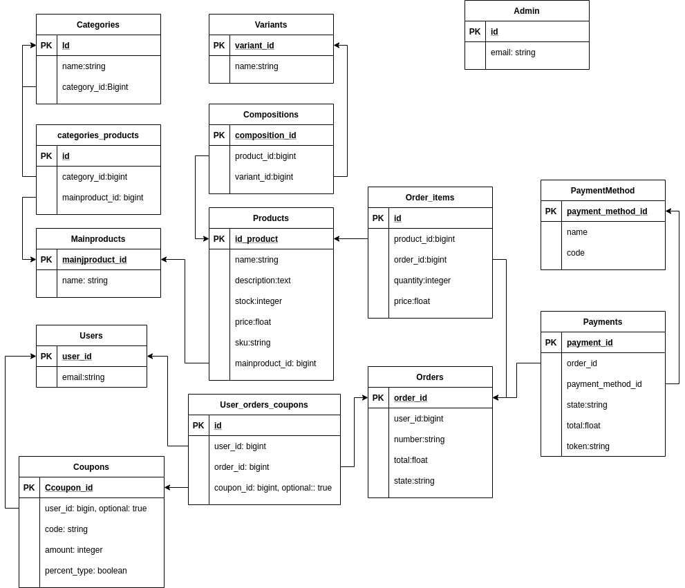
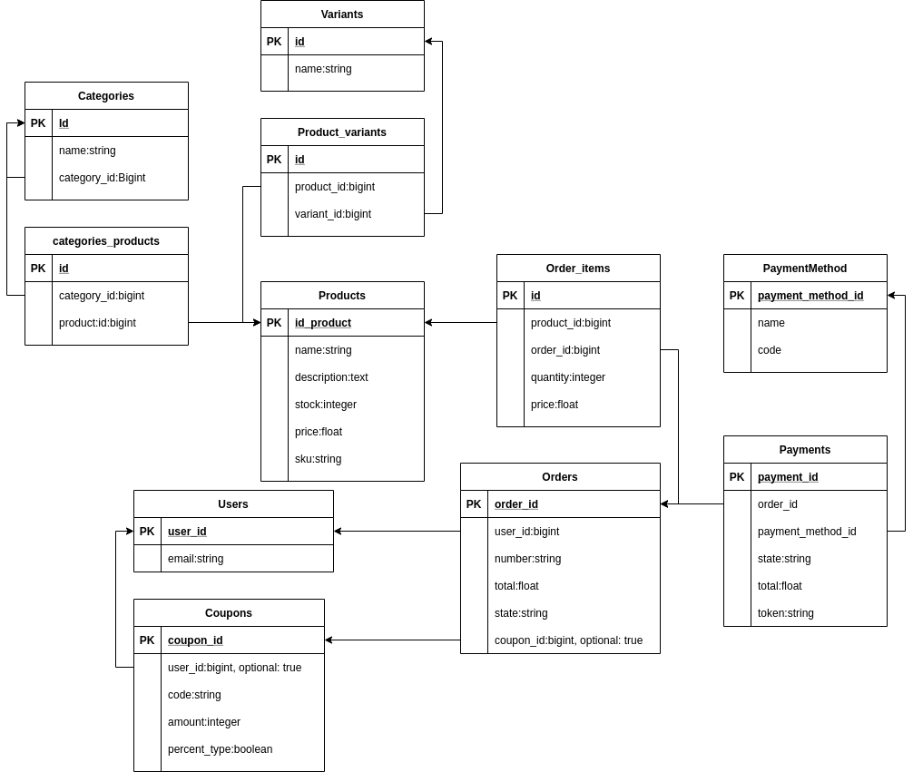

# README
## Nuevo diagrama de aplicación:
Según las indicaciones entregadas la base de datos ha sido modificada de la siguiente manera:



### Detalle de cambios:

- Modelo Mainproduct agregado: es la entidad que hace referencia a un producto de manera genérica. EJ: "Polera_logo_1"

- Modelo Variant agregado: es la entidad donde se generan las variantes de los productos. EJ: "Talla:X", "Color:Verde"

- Modelo Composition agregado: Es el modelo que reune cada producto con su composición de variantes. EJ: "Polera_logo_1" + "Talla:X" y "Polera_Logo_1" + "Color:Verde"

- Atributo category_id agregado a Modelo Category: Atributo opcional que señala la categoría padre del registro. Al ser un solo atributo implica que una categoría como máximo podrá tener una categoría padre.

```
```

## Implementar catálogo:
Para implementar catálogo con los requerimientos descritos se deberá ser extraer desde el modelo Mainproduct. El modelo tiene definidos los metodos catalog y show_catalog con los que podrá señalar si alguna de sus variantes tiene stock y seleccionar una variante con stock para poner en el catálogo.

Ejemplo:
```
    #Creación de producto principal
    ProductoPPAL = Mainproduct.create(name:"Polera_logo_1")
    
    #Creación de variantes
    Variante_Talla_1 = Variant.create(name:"Talla:X")
    Variante_Talla_2 = Variant.create(name:"Talla:M")
    Variante_Color_1 = Variant.create(name:"Color:Verde")
    
    #Creación de Productos con variante
    Producto_1 = Product.create(name:"Polera Logo 1 Talla:X Color:Verde", stock:20, sku:'123456', price:10000, mainproduct_id:1)
    Composition.create(product_id:1,variant_id:1) #Variante talla X
    Composition.create(product_id:1,variant_id:3) #Variante color verde

    Producto_2 = Product.create(name:"Polera Logo 1 Talla:M Color:Verde", stock:0, sku:'654321', price:10000, mainproduct_id:1)
    Composition.create(product_id:1,variant_id:2) #Variante talla M
    Composition.create(product_id:1,variant_id:3) #Variante color verde

    ProductoPPAL.catalog #Retorna true al detectar que Producto_1 tiene stock
    ProductoPPAL.show_catalog #Retorna el objeto Producto_1 por ser la variante con stock
```


La estructura implementada permite conservar el modelo OrderItem sin modificaciones, ya que sigue estando relacionada a la entidad product.

## Para implementar cupones:
Recomiendo crear la siguiente estructura de BBDD:



## Coupon:
### user_id:integer - clave foránea de usuario, Campo opcional.  
Referencia al usuario dueño del cupón. Solo se debe utilizar para cupones personales. Si este campo es distinto de 'nil' enotnces se entiende que es cupón personal y que la orden debe validar id del cliente antes de aplicar el descuento.  
### code:string - Nombre del cupón, Campo obligatorio.
Nombre con cupón que el cliente debe ingresar al momento de cerrar su compra
### percent_type:boolean - Tipo de cupón, campo obligatorio  
Indica si el cupón es de porcentaje de descuento (true) o un monto fijo
### amount:integer - Monto del cupón, campo obligatorio
Indica el monto del descuento. Es importante restringir el rango dependiendo de la naturaleza del cupón indicada en 'percent_type':
- percent_type = true, implica que el rango debe ir de 0 a 100, tomando el número como porcentaje de descuento sobre el monto final de la orden
- percent_type = false, implica que el rango debe ser positivo y se restará al monto total de la orden 

## User_coupon
### order_id:integer - Clave foranea de la orden, campo obligatorio
Referencia a la orden que está cerrando el usuario.
### user_id - Clave foranea del usuario, campo obligatorio
Referencia al usuario que está cerrando la orden.
### coupon_id - Clave foránea del cupón, campo 
Referencia al cupón utilizado en la orden.

(*) Es importante destacar que este modelado permite el uso de más de un cupón por orden, siendo un diseño más flexible. Se podría optar por simplemente agregar un atributo opcional de coupon_id al modelo Order, pero esto implicaría que solo se podrá utilizar un solo cupón por venta. 
En caso de querer aplicar el modelado recien descrito adjunto la imagen:

