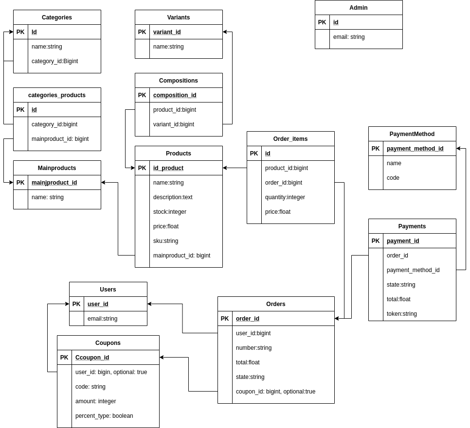

# README
## Para implementar cupones:
Recomiendo crear la siguiente estructura de BBDD:

## Coupon:
### user_id:integer - clave foránea de usuario, Campo opcional.  
Referencia al usuario dueño del cupón. Solo se debe utilizar para cupones personales. Si este campo es distinto de 'nil' enotnces se entiende que es cupón personal y que la orden debe validar id del cliente antes de aplicar el descuento.  
### code:string - Nombre del cupón, Campo obligatorio.
Nombre con cupón que el cliente debe ingresar al momento de cerrar su compra
### percent_type:boolean - Tipo de cupón, campo obligatorio  
Indica si el cupón es de porcentaje de descuento (true) o un monto fijo
### amount:integer - Monto del cupón, campo obligatorio
Indica el monto del descuento. Es importante restringir el rango dependiendo de la naturaleza del cupón indicada en 'percent_type':
- percent_type = true, implica que el rango debe ir de 0 a 100, tomando el número como porcentaje de descuento sobre el monto final de la orden
- percent_type = false, implica que el rango debe ser positivo y se restará al monto total de la orden 

## User_coupon
### order_id:integer - Clave foranea de la orden, campo obligatorio
Referencia a la orden que está cerrando el usuario.
### user_id - Clave foranea del usuario, campo obligatorio
Referencia al usuario que está cerrando la orden.
### coupon_id - Clave foránea del cupón, campo 
Referencia al cupón utilizado en la orden.

(*) Es importante destacar que este modelado permite el uso de más de un cupón por orden, siendo un diseño más flexible. Se podría optar por simplemente agregar un atributo opcional de coupon_id al modelo Order, pero esto implicaría que solo se podrá utilizar un solo cupón por venta.